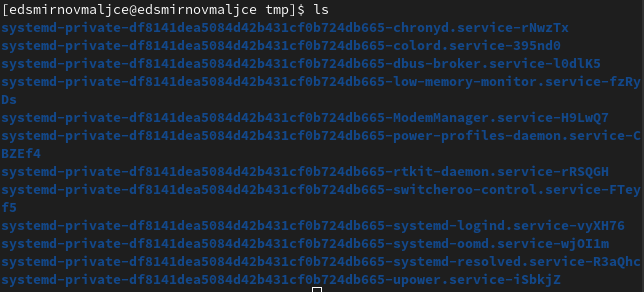
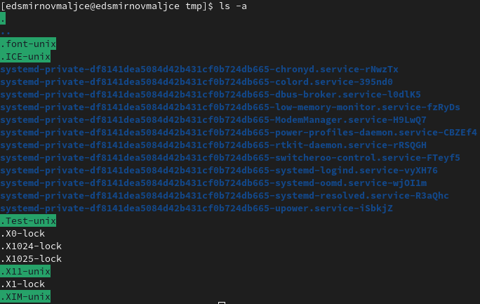
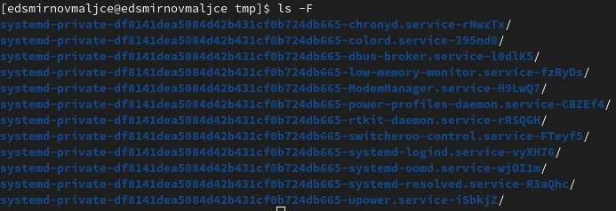
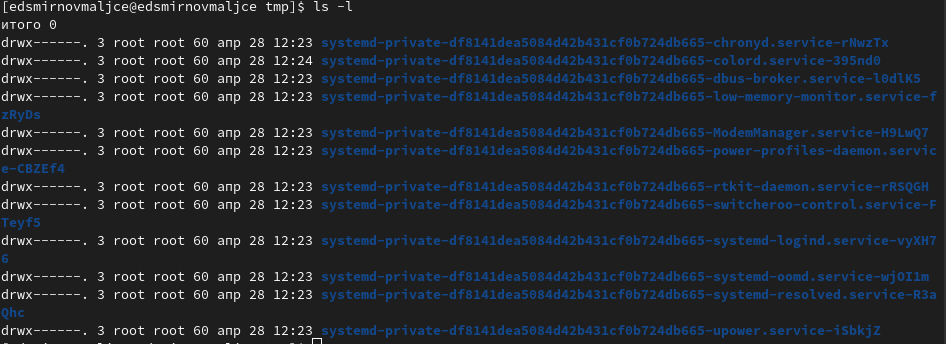
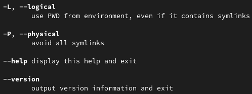
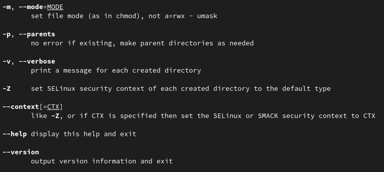
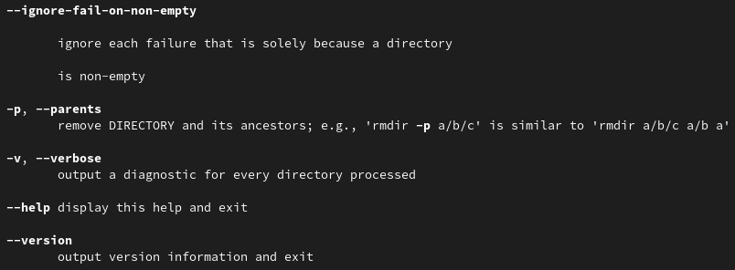
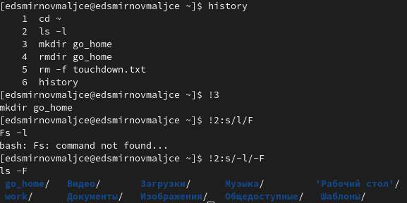

---
## Front matter
title: "Отчёт по лабораторной работе №4"
subtitle: " Основы интерфейса взаимодействия пользователя с системой Unix на уровне командной строки"
author: "Смирнов-Мальцев Егор Дмитриевич"

## Generic otions
lang: ru-RU
toc-title: "Содержание"

## Bibliography
bibliography: bib/cite.bib
csl: pandoc/csl/gost-r-7-0-5-2008-numeric.csl

## Pdf output format
toc-depth: 2
fontsize: 12pt
linestretch: 1.5
papersize: a4
documentclass: scrreprt
## I18n polyglossia
polyglossia-lang:
  name: russian
  options:
	- spelling=modern
	- babelshorthands=true
polyglossia-otherlangs:
  name: english
## I18n babel
babel-lang: russian
babel-otherlangs: english
## Fonts
mainfont: PT Serif
romanfont: PT Serif
sansfont: PT Sans
monofont: PT Mono
mainfontoptions: Ligatures=TeX
romanfontoptions: Ligatures=TeX
sansfontoptions: Ligatures=TeX,Scale=MatchLowercase
monofontoptions: Scale=MatchLowercase,Scale=0.9
## Biblatex
biblatex: true
biblio-style: "gost-numeric"
biblatexoptions:
  - parentracker=true
  - backend=biber
  - hyperref=auto
  - language=auto
  - autolang=other*
  - citestyle=gost-numeric
## Pandoc-crossref LaTeX customization
figureTitle: "Рис."
tableTitle: "Таблица"
listingTitle: "Листинг"
lofTitle: "Список иллюстраций"
lolTitle: "Листинги"
## Misc options
indent: true
header-includes:
  - \usepackage{indentfirst}
  - \usepackage{float} # keep figures where there are in the text
  - \floatplacement{figure}{H} # keep figures where there are in the text
---

# Цель работы

* Приобретение практических навыков взаимодействия пользователя с системой посредством командной строки.

# Задание

* Выполнить основные команды командной строки.

# Выполнение лабораторной работы

1. Узнал полное имя домашней директории.(рис. 1)

<figure>
	
	<figcaption>рис 1. Вывод полного имени домашней директории.</figcaption>
<figure>

2. Изучил основы работы с командой ls.
		
2.1. Перешел в каталог /tmp.(рис. 2)
<figure>
	
	<figcaption>рис 2. Переход в каталог /tmp</figcaption>
<figure>

2.2. Узнал содержимое данного каталога в различных форматах.
	
2.2.1. Вывел общую информацию о содержимом.(рис. 3)

<figure>
	
	<figcaption>рис 3. Вывод общей информации о содержимом каталога</figcaption>
<figure>

2.2.2. Вывел все содержимое каталога, в том числе скрытые файлы.(рис. 4)

<figure>
	
	<figcaption>рис 4. Вывод всего содержимого каталога</figcaption>
<figure>

2.2.3. Вывел содержимое каталога с типом объекта.(рис. 5)
				
<figure>
	
	<figcaption>рис 5. Вывод содержимого каталога с типом объекта</figcaption>
<figure>

2.2.4. Вывел содержимое каталога с подробной информацией о каждом объекте.(рис. 6)
				
<figure>
	
	<figcaption>рис 6. Вывод содержимого каталога с подробной информацией</figcaption>
<figure>

2.3. Проверил, есть ли в каталоге /var/spool подкаталог с именем cron.(рис. 7)
		
<figure>
	
	<figcaption>рис 7. Вывод содержимого каталога /var/spool</figcaption>
<figure>

2.4. Перешел в домашний каталог и убедился в том, что все его содержимое принадлежит мне.(рис. 8)

<figure>
	
	<figcaption>рис 8. Проверка принадлежности файлов и подкаталогов домашнего каталога</figcaption>
<figure>

3. Изучил основы работы с каталогами.

3.1. В домашнем каталоге создал подкаталог с названием newdir.(рис. 9)
		
<figure>
	
	<figcaption>рис 9. Создание каталога newdir</figcaption>
<figure>

3.2. В каталоге newdir создал подкаталог morefun.(рис. 10)
		
<figure>
	
	<figcaption>рис 10. Создание каталога morefun</figcaption>
<figure>

3.3. Создал и удалил подкаталоги letters, memos, misk в домашнем каталоге. (рис. 11)

<figure>
	
	<figcaption>рис 11. Создание и удаление каталогов letters, memos, misk</figcaption>
<figure>

3.4. Удалил каталог newdir с помощью команды rm. Проверил успешность удаления.(рис. 12)
		
<figure>
	
	<figcaption>рис 12. Удаление каталога newdir</figcaption>
<figure>

3.5. В задании написано удалить каталог morefun, но он был удален на прошлом шаге, поэтому ничего не делал.

4. С помощью команды man узнал с помощью какой опции команды ls можно узнать список содержимого не только каталога, но и его подкаталогов.(рис. 13)

<figure>
	
	<figcaption>рис 13. Опция команды ls, позволяющая узнать список содержимого подкаталогов</figcaption>
<figure>

5. С помощью команды man узнал с помощью какой набор опций команды ls можно узнать список содержимого отсортированный по времени изменения и с подробной информацией об объектах.(рис. 14, 15)

<figure>
	
	<figcaption>рис 14. Опция команды ls, позволяющая отсортировать объекты по дате изменения</figcaption>
<figure>

<figure>
	
	<figcaption>рис 15. Опция команды ls, позволяющая вывести подробную информацию об объектах</figcaption>
<figure>

6. С помощью команды man узнал опции основных команд.

6.1. У команды cd опций нет.
		
6.2. У команды pwd следующие опции: -L, --logical - брать директорию из переменной окружения, даже если она содержит символические ссылки; -P - отбрасывать все символические ссылки; --help - отобразить справку по утилите; --version - отобразить версию утилиты.(рис. 16)
		
<figure>
	
	<figcaption>рис 16. Опции команды pwd</figcaption>
<figure>

6.3. У команды mkdir следующие опции: -m, --mode=MODE - определить права доступа к директории; -p, --parents - создать все директории указанные в пути, если директория существует, то не выдавать ошибку; -v, --verbose - вывести сообщение о каждой созданной директории; -Z - установить контекст SELinux по умолчанию; --context[=CTX] - установить контекст SELinux по значению в CTX; --help - вывести экран помощи; --version - отобразить версию утилиты.(рис. 17)
		
<figure>
	
	<figcaption>рис 17. Опции команды mkdir</figcaption>
<figure>

6.4. У команды rmdir следующие опции: --ignore-fail-on-non-empty - игнорировать все ошибки, вызванные пустотой директории; -p, --parents - удалить директорию и всех ее предков, указанных в пути; -v, --verbose - вывести информацию о каждой задействованной директории; --help - вывести экран с руководством о команде; --version - вывести версию утилиты.(рис. 18)
		
<figure>
	
	<figcaption>рис 18. Опции команды rmdir</figcaption>
<figure>

6.5. У команды rm следующие опции: -f, --force - игнорировать несуществующие файлы и аргументы; -i - вывести подсказку о каждом удаляемом объекте; -I - вывести подсказку при удалении больше 3 файлов или при рекурсивном удалении, менее назойливая, чем -i, но все еще предотвращает большинство ошибок; --interactive[=WHEN] - выводит подсказки согласно WHEN; --one-file-system - при рекурсивном удалении пропускать директории, находящиеся в других файловых системах; --no-preserve-root - не защищать корневую директорию от удаления; --preserve-root - защищать корневую директорию от удаления; -r, -R, --recursive - рекурсивное удаление; -d, -dir - удалить пустую директорию; -v, --verbose - вывести информацию о том, что происходит; --help - вывести экран с руководством о команде; --version - вывести версию утилиты.(рис. 19)
		
<figure>
	
	<figcaption>рис 19. Опции команды rm</figcaption>
<figure>

7. С помощью команды history и конструкции !<номер команды> использовал предыдущие команды.(рис. 20)

<figure>
	
	<figcaption>рис 20. Использование команд из буфера</figcaption>
<figure>

# Контрольные вопросы

1. Командная строка - это система взаимодействия пользователя и компьютера. Пользователь через нее вводит команду, а компьютер ее выполняет.

2. Абсолютный путь текущего каталога можно узнать с помощью команды pwd:
```
$ pwd
```

3. Определить имена и тип объектов в каталоге можно с помощью команды ls с опцией -F:
```
$ ls -F
$ ls -F /tmp
```

4. Информацию о скрытых файлах можно получить с помощью команды ls с опцией a:
```
$ ls -a
```

5. Удалить файл можно с помощью команды rm, каталог - с помощью команды rm с опцией d или с помощью команды rmdir.
```
$ rm touch.txt
$ rm -d ~/files
$ rmdir ~/files
```

6. Вывести информацию о последних командах можно с помощью команды history. В качестве аргумента можно написать количество последних команд.
```
$ history
$ history 5
```

7. Чтобы вывести предыдущую команду, надо написать !<номер команды>. Для того, чтобы модифицировать ее, надо добавить s/<что заменить>/<на что заменить>:
```
$ !5
ls -a
$ !5 s/-a/-F
ls -F
```

8. Чтобы запустить в одной строке несколько команд надо записать их через ';':
```
$ ls; cd ~
```

9. Когда управляющие символы встречаются в тексте, они могут быть неправильно восприняты компилятором. Поэтому в случае, когда они должны быть восприняты как обычный символ перед ними надо поставить '\'.
```
$ cd Операционные\ системы
$ cd 7\$
```

10. После выполнения команды ls -l выводится полная информация об объектах директории: права доступа, хозяин, размер, дата изменения, название.

11. Относительный путь до объекта - путь из данной директории. Абсолютный - путь из корневого каталога:
```
$ ls work
$ ls /home/edsmirnovmaljce/work
```


12. Чтобы получить информацию о команде на выполнить man <команда>:
```
$ man cd
```

13. tab автоматически дополняет команду. ctrl+tab показывает варианты дополнения.

# Выводы

* Я изучил основные команды для работы с командно строкой.
