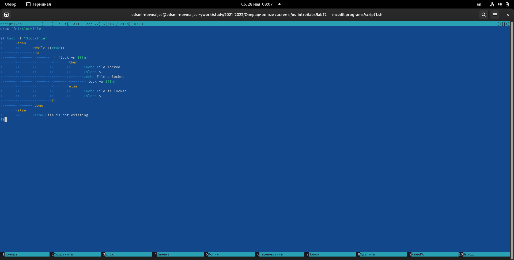
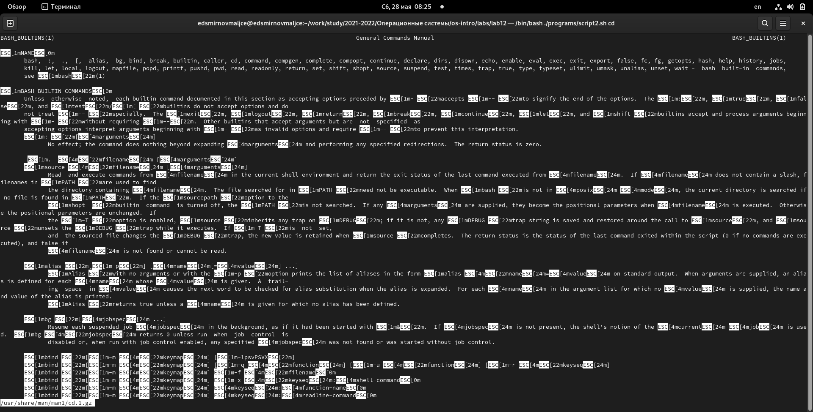

---
## Front matter
title: "Отчёт по лабораторной работе №12"
subtitle: "Программирование в командном процессоре ОС UNIX. Расширенное программирование."
author: "Смирнов-Мальцев Егор Дмитриевич"

## Generic otions
lang: ru-RU
toc-title: "Содержание"

## Bibliography
bibliography: bib/cite.bib
csl: pandoc/csl/gost-r-7-0-5-2008-numeric.csl

## Pdf output format
toc-depth: 2
fontsize: 12pt
linestretch: 1.5
papersize: a4
documentclass: scrreprt
## I18n polyglossia
polyglossia-lang:
  name: russian
  options:
	- spelling=modern
	- babelshorthands=true
polyglossia-otherlangs:
  name: english
## I18n babel
babel-lang: russian
babel-otherlangs: english
## Fonts
mainfont: PT Serif
romanfont: PT Serif
sansfont: PT Sans
monofont: PT Mono
mainfontoptions: Ligatures=TeX
romanfontoptions: Ligatures=TeX
sansfontoptions: Ligatures=TeX,Scale=MatchLowercase
monofontoptions: Scale=MatchLowercase,Scale=0.9
## Biblatex
biblatex: true
biblio-style: "gost-numeric"
biblatexoptions:
  - parentracker=true
  - backend=biber
  - hyperref=auto
  - language=auto
  - autolang=other*
  - citestyle=gost-numeric
## Pandoc-crossref LaTeX customization
figureTitle: "Рис."
tableTitle: "Таблица"
listingTitle: "Листинг"
lofTitle: "Список иллюстраций"
lolTitle: "Листинги"
## Misc options
indent: true
header-includes:
  - \usepackage{indentfirst}
  - \usepackage{float} # keep figures where there are in the text
  - \floatplacement{figure}{H} # keep figures where there are in the text
---

# Цель работы

* Изучить основы программирования в оболочке ОС UNIX. Научиться писать более сложные командные файлы с использованием логических управляющих конструкций и циклов.

# Задание

1. Написать командный файл, реализующий упрощённый механизм семафоров. Командный файл должен в течение некоторого времени t1 дожидаться освобождения ресурса, выдавая об этом сообщение, а дождавшись его освобождения, использовать его в течение некоторого времени t2<>t1, также выдавая информацию о том, что ресурс используется соответствующим командным файлом (процессом). Запустить командный файл в одном виртуальном терминале в фоновом режиме, перенаправив его вывод в другой (> /dev/tty#, где # — номер терминала куда перенаправляется вывод), в котором также запущен этот файл, но не фоновом, а в привилегированном режиме. Доработать программу так, чтобы имелась возможность взаимодействия трёх и более процессов.
2. Реализовать команду man с помощью командного файла. Изучите содержимое каталога /usr/share/man/man1. В нем находятся архивы текстовых файлов, содержащих справку по большинству установленных в системе программ и команд. Каждый архив можно открыть командой less сразу же просмотрев содержимое справки. Командный файл должен получать в виде аргумента командной строки название команды и в виде результата выдавать справку об этой команде или сообщение об отсутствии справки, если соответствующего файла нет в каталоге man1.
3. Используя встроенную переменную $RANDOM, напишите командный файл, генерирующий случайную последовательность букв латинского алфавита. Учтите, что $RANDOM выдаёт псевдослучайные числа в диапазоне от 0 до 32767.

# Теоретическое введение

Командный процессор (командная оболочка, интерпретатор команд shell) — это программа, позволяющая пользователю взаимодействовать с операционной системой компьютера. В операционных системах типа UNIX/Linux наиболее часто используются следующие реализации командных оболочек:
* оболочка Борна (Bourne shell или sh) — стандартная командная оболочка UNIX/Linux, содержащая базовый, но при этом полный набор функций;
* С-оболочка (или csh) — надстройка на оболочкой Борна, использующая С-подобный синтаксис команд с возможностью сохранения истории выполнения команд;
* оболочка Корна (или ksh) — напоминает оболочку С, но операторы управления программой совместимы с операторами оболочки Борна;
* BASH — сокращение от Bourne Again Shell (опять оболочка Борна), в основе своей совмещает свойства оболочек С и Корна (разработка компании Free Software Foundation).

POSIX (Portable Operating System Interface for Computer Environments) — набор стандартов описания интерфейсов взаимодействия операционной системы и прикладных программ. Стандарты POSIX разработаны комитетом IEEE (Institute of Electrical and Electronics Engineers) для обеспечения совместимости различных UNIX/Linux-подобных операционных систем и переносимости прикладных программ на уровне исходного кода. POSIX-совместимые оболочки разработаны на базе оболочки Корна.

# Выполнение лабораторной работы

1. Написал командный файл, реализующий упрощённый механизм семафоров. Командный файл в течение некоторого времени t1 дожидается освобождения ресурса, выдавая об этом сообщение, а дождавшись его освобождения, использует его в течение некоторого времени t2<>t1, также выдавая информацию о том, что ресурс используется соответствующим командным файлом (процессом). Запустил командный файл в одном виртуальном терминале в фоновом режиме, перенаправив его вывод в другой (> /dev/tty#, где # — номер терминала куда перенаправляется вывод), в котором также запущен этот файл, но не фоновом, а в привилегированном режиме. Доработал программу так, чтобы имелась возможность взаимодействия трёх и более процессов.

<figure>
	
	<figcaption>рис. 1: текст первого скрипта.</figcaption>
<figure>

2. Реализовал команду man с помощью командного файла. Изучил содержимое каталога /usr/share/man/man1. В нем находятся архивы текстовых файлов, содержащих справку по большинству установленных в системе программ и команд. Каждый архив можно открыть командой less сразу же просмотрев содержимое справки. Командный файл получает в виде аргумента командной строки название команды и в виде результата выдает справку об этой команде или сообщение об отсутствии справки, если соответствующего файла нет в каталоге man1.

<figure>
	
	<figcaption>рис. 2: выполнение второго скрипта.</figcaption>
<figure>

3. Используя встроенную переменную $RANDOM, написал командный файл, генерирующий случайную последовательность букв латинского алфавита.

<figure>
	
	<figcaption>рис. 3: выполнение третьего скрипта.</figcaption>
<figure>


# Ответы на контрольные вопросы

1. В строке 
```
while [$1 != "exit"]
```
пропущены пробелы рядом с квадратными скобками.

2. Две строки можно объединить записав их в третью переменную:
```
var3="$var1$var2"
```

3. Утилита sec выводит последовательность целых чисел с шагом, заданным пользователем. Ее функционал можно реализовать простейшим циклом, который прибавляет число, введенное пользователем и выводит его.

4. Выражение $((10/3)) выдает число 3.

5. Основные отличия zsh от bash:
* Zsh более интерактивный и настраиваемый, чем Bash.
* У Zsh есть поддержка с плавающей точкой, которой нет у Bash.
* В Zsh поддерживаются структуры хеш-данных, которых нет в Bash.
* Функции вызова в Bash лучше по сравнению с Zsh.
* Внешний вид подсказки можно контролировать в Bash, тогда как Zsh настраивается.
* Конфигурационными файлами являются .bashrc в интерактивных оболочках без регистрации и .profile или .bash_profile в оболочках входа в Bash. В Zsh оболочками, не входящими в систему, являются .zshrc, а оболочками для входа - .zprofile.
* Массивы Zsh индексируются от 1 до длины, тогда как Bash индексируется от -1 до длины.
* В Zsh, если шаблоны не совпадают ни с одним файлом, выдается ошибка. Находясь в Баше, он остается без изменений.
* Правая часть конвейера запускается как родительская оболочка в Zsh, в то время как в Bash она запускается как подоболочка.
* В Zsh функция zmv используется для массового переименования, тогда как в Bash мы должны использовать функцию расширения параметров.
* Bash имеет хорошие возможности написания сценариев в одной строке, в то время как в Zsh мы не смогли найти то же самое.
* По умолчанию выходные данные хранятся во временном файле в Zsh, а в Bash - нет.
* Многие встроенные функции в Bash упрощают сложные программы, тогда как в Zsh встроенных функций для сложных программ меньше.
* Zsh эффективно управляет своими файлами, в то время как Bash плохо умеет работать с файлами.

6. Синтаксис следующей строчки верен.
```
for ((a=1; a <= LIMIT; a++))
```

7. bash позволяет напрямую обращаться к командам, одно такие языки, как Python значительно проще.

# Выводы

* Я научился писать командные файлы с использованием управляющих конструкций и циклов.
