---
## Front matter
title: "Отчёт по первому этапу выполнения самостоятельного проекта"
subtitle: ""
author: "Смирнов-Мальцев Егор Дмитриевич"

## Generic otions
lang: ru-RU
toc-title: "Содержание"

## Bibliography
bibliography: bib/cite.bib
csl: pandoc/csl/gost-r-7-0-5-2008-numeric.csl

## Pdf output format
toc-depth: 2
fontsize: 12pt
linestretch: 1.5
papersize: a4
documentclass: scrreprt
## I18n polyglossia
polyglossia-lang:
  name: russian
  options:
	- spelling=modern
	- babelshorthands=true
polyglossia-otherlangs:
  name: english
## I18n babel
babel-lang: russian
babel-otherlangs: english
## Fonts
mainfont: PT Serif
romanfont: PT Serif
sansfont: PT Sans
monofont: PT Mono
mainfontoptions: Ligatures=TeX
romanfontoptions: Ligatures=TeX
sansfontoptions: Ligatures=TeX,Scale=MatchLowercase
monofontoptions: Scale=MatchLowercase,Scale=0.9
## Biblatex
biblatex: true
biblio-style: "gost-numeric"
biblatexoptions:
  - parentracker=true
  - backend=biber
  - hyperref=auto
  - language=auto
  - autolang=other*
  - citestyle=gost-numeric
## Pandoc-crossref LaTeX customization
figureTitle: "Рис."
tableTitle: "Таблица"
listingTitle: "Листинг"
lofTitle: "Список иллюстраций"
lolTitle: "Листинги"
## Misc options
indent: true
header-includes:
  - \usepackage{indentfirst}
  - \usepackage{float} # keep figures where there are in the text
  - \floatplacement{figure}{H} # keep figures where there are in the text
---

# Цель работы

* Научиться создавать сайты по шаблону.

# Задание

* Создать сайт с помощью hugo по шаблону данному в описании работы.

# Выполнение первого этапа самостоятельного проекта

1. Скачал последнюю версию hugo с github.(рис. 1)

<figure>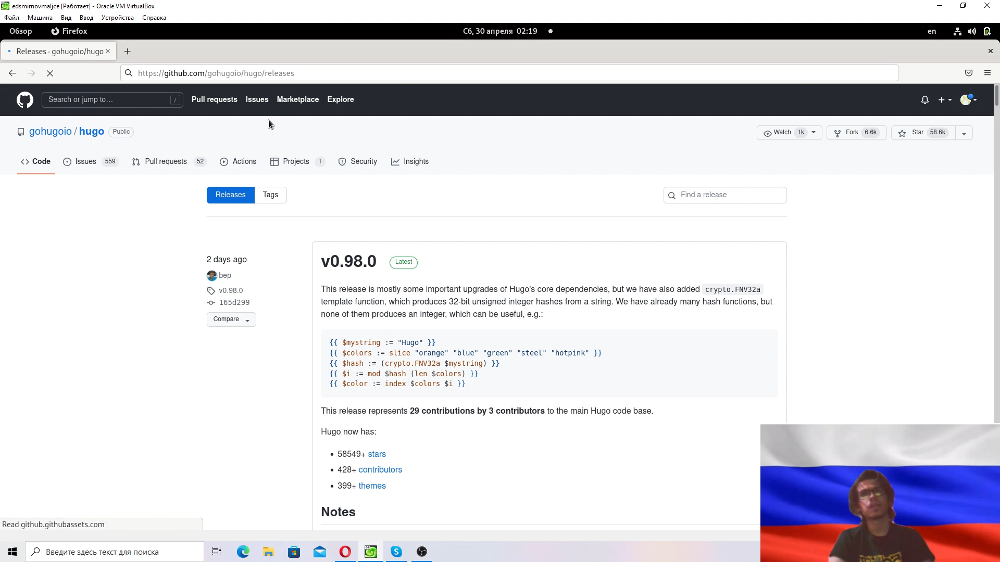
	
	<figcaption>рис. 1. Репозиторий с последней версией hugo</figcaption>
<figure>

2. Создал на github репозиторий с именем blog по шаблону указанному в задании.(рис. 2)

<figure>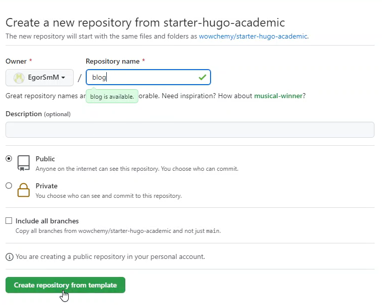
	
	<figcaption>рис. 2. Страница создания репозитория на github</figcaption>
<figure>

3. Клонировал репозиторий на свой компьютер.(рис. 3)

<figure>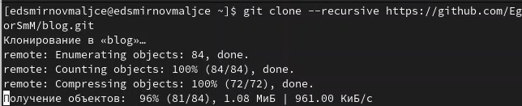
	
	<figcaption>рис. 3. Клонирование репозитория с Github</figcaption>
<figure>

4. Запустил hugo в локальном репозитории.(рис. 4)

<figure>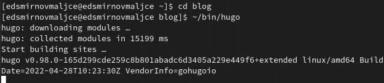
	
	<figcaption>рис. 4. Запуск hugo.</figcaption>
<figure>

5. Удалил public из папки blog.(рис. 5)

<figure>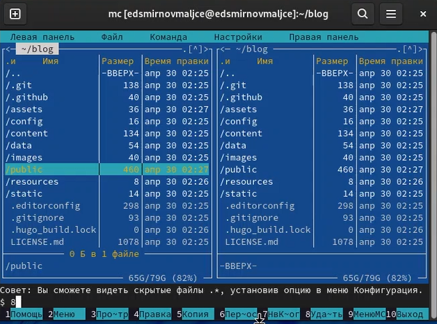
	
	<figcaption>рис. 5. Удаление public.</figcaption>
<figure>

6. Запустил hugo server и создал сайт на локальном хосте.(рис. 6)

<figure>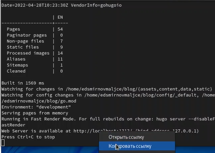
	
	<figcaption>рис. 6. Создание сайта на локальном хосте.</figcaption>
<figure>

7. Удалил лишнюю часть сайта.(рис. 7)

<figure>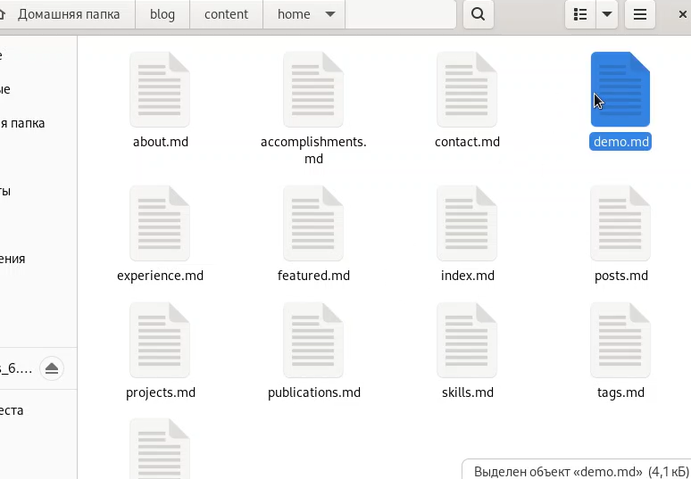
	
	<figcaption>рис. 7. Удаление файла demo.md.</figcaption>
<figure>

8. Создал репозиторий для общедоступного сайта.(рис. 8)

<figure>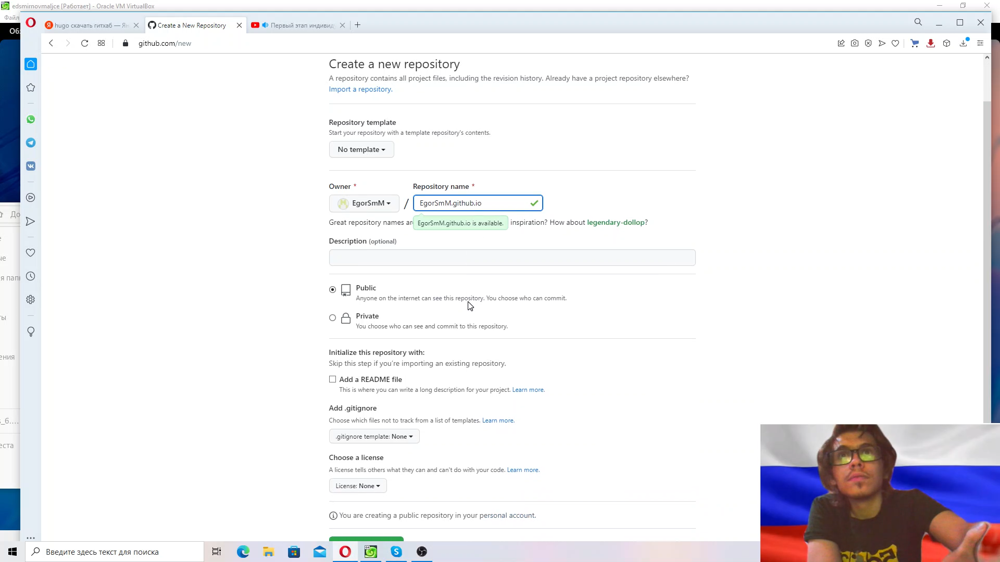
	
	<figcaption>рис. 8. Создание репозитория для общедоступного сайта.</figcaption>
<figure>

9. Создал ветку main и отправил изменения на github.(рис. 9)

<figure>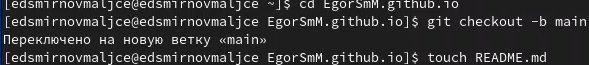
	
	<figcaption>рис. 9. Создание ветки main.</figcaption>
<figure>

10. Подключил репозиторий для сайта к папке public из blog.(рис. 10)

<figure>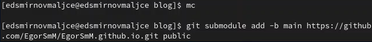
	
	<figcaption>рис. 10. Подключение папки public.</figcaption>
<figure>

11. Добавил в public файлы с помощью hugo.(рис. 11)

<figure>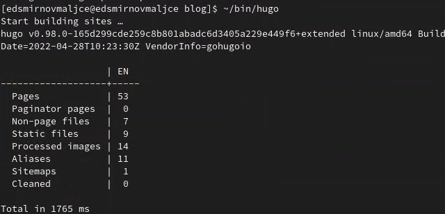
	
	<figcaption>рис. 11. Заполнение папки public.</figcaption>
<figure>

12. Добавил изменения в public на репозиторий на github.(рис. 12)

<figure>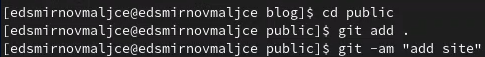
	
	<figcaption>рис. 12. Создание коммита с измениями в public.</figcaption>
<figure>

# Выводы

* Я создал сайт по шаблону.
