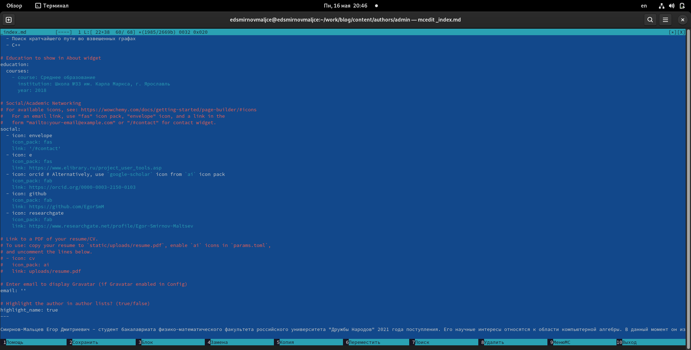
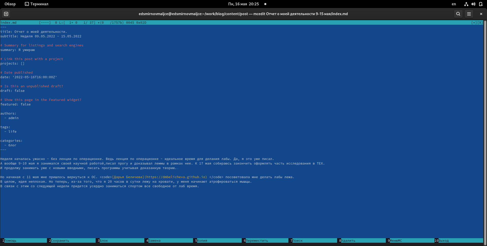
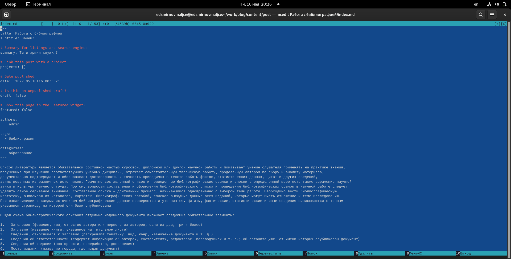

---
## Front matter
title: "Отчёт по четвертому этапу выполнения самостоятельного проекта"
subtitle: ""
author: "Смирнов-Мальцев Егор Дмитриевич"

## Generic otions
lang: ru-RU
toc-title: "Содержание"

## Bibliography
bibliography: bib/cite.bib
csl: pandoc/csl/gost-r-7-0-5-2008-numeric.csl

## Pdf output format
toc-depth: 2
fontsize: 12pt
linestretch: 1.5
papersize: a4
documentclass: scrreprt
## I18n polyglossia
polyglossia-lang:
  name: russian
  options:
	- spelling=modern
	- babelshorthands=true
polyglossia-otherlangs:
  name: english
## I18n babel
babel-lang: russian
babel-otherlangs: english
## Fonts
mainfont: PT Serif
romanfont: PT Serif
sansfont: PT Sans
monofont: PT Mono
mainfontoptions: Ligatures=TeX
romanfontoptions: Ligatures=TeX
sansfontoptions: Ligatures=TeX,Scale=MatchLowercase
monofontoptions: Scale=MatchLowercase,Scale=0.9
## Biblatex
biblatex: true
biblio-style: "gost-numeric"
biblatexoptions:
  - parentracker=true
  - backend=biber
  - hyperref=auto
  - language=auto
  - autolang=other*
  - citestyle=gost-numeric
## Pandoc-crossref LaTeX customization
figureTitle: "Рис."
tableTitle: "Таблица"
listingTitle: "Листинг"
lofTitle: "Список иллюстраций"
lolTitle: "Листинги"
## Misc options
indent: true
header-includes:
  - \usepackage{indentfirst}
  - \usepackage{float} # keep figures where there are in the text
  - \floatplacement{figure}{H} # keep figures where there are in the text
---

# Цель работы

* Научиться добавлять ссылки на свои ресурсы.

# Задание

* Зарегистрироваться на соответствующих ресурсах и разместить на них ссылки на сайте:
1. eLibrary : https://elibrary.ru/;
2. Google Scholar : https://scholar.google.com/;
3. ORCID : https://orcid.org/;
4. Mendeley : https://www.mendeley.com/;
5. ResearchGate : https://www.researchgate.net/;
6. Academia.edu : https://www.academia.edu/;
7. arXiv : https://arxiv.org/;
8. github : https://github.com/.
* Сделать пост по прошедшей неделе.
* Добавить пост на тему по выбору:
1. Оформление отчёта.
2. Создание презентаций.
3. Работа с библиографией.

# Выполнение третьего этапа самостоятельного проекта

1. Добавил добавил ссылки на свои ресурсы на сайт (рис. 1).

<figure>
	
	<figcaption>рис. 1: добавление ссылок на ресурсы</figcaption>
<figure>

2. Добавил пост о прошедшей неделе (рис. 2).

<figure>
	
	<figcaption>рис. 2: пост о прошедшей неделе</figcaption>
<figure>

3. Добавил пост о работе с библиографией (рис. 3).

<figure>
	
	<figcaption>рис. 3: пост о работе с библиографией</figcaption>
<figure>

# Выводы

* Я научился добавлять ссылки на свои ресурсы.
